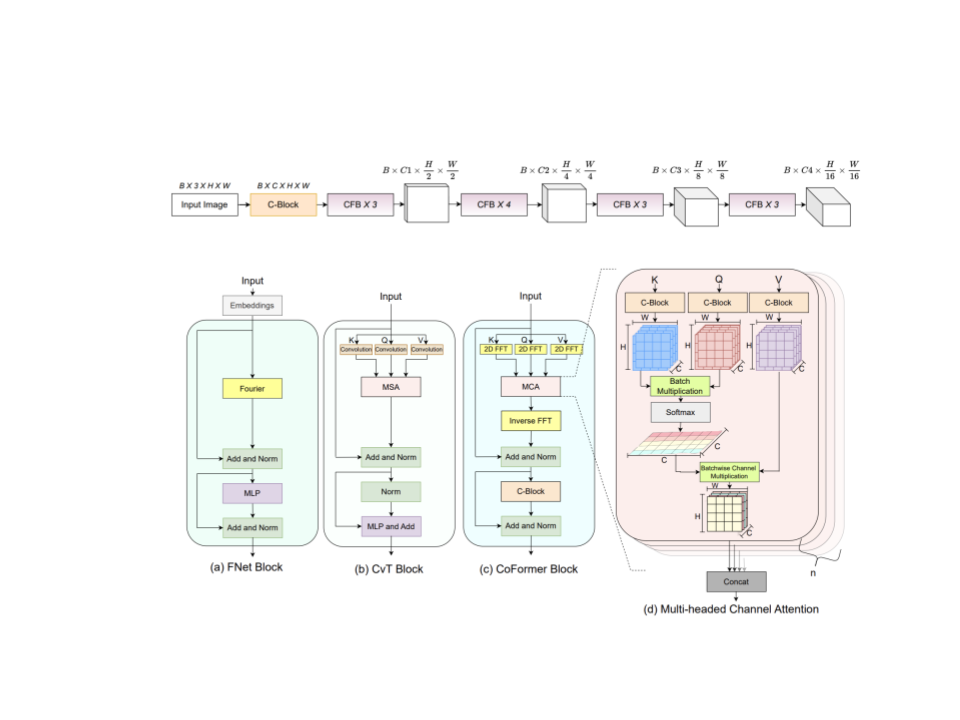

This is the official reposiotry of CoFormer for Scene Text Understanding




To Train the CoFormer,

Installation and requirements:

```
conda create -n cofermer python==3.8

conda activate cofermer

pip3 install -r requirements.txt
```


Firstly go in the directory `_make_data`
Create the synthetic data as per the instructions given the README.md

Update the the training directory and model_save directory path in the `cfg.py`
change the hyper-parameters in the `cfg.py` according to your system

Change the `data_dir ` and `checkpoint_savedir` path fin the `cfg.py`

For training:

run `train.py`

To Infer the model

To get the direct inference download pretrained model weights from here and put it in the "trained_model" directory

give the firslty change the saved model path in the `cfg.py` and run the `infer.py`


please cite 

```
@inproceedings { ref186,
	
 title            = "Textual Alchemy: CoFormer for Scene Text Understanding",
	
 year             = "2024",
	
 author           = "Gayatri Deshmukh and Onkar Susladkar and Dhruv Makwana and Sparsh Mittal and R Sai Chandra Teja",
 
booktitle        = "IEEE/CVF Winter Conference on Applications of Computer Vision (WACV)"

}
```
